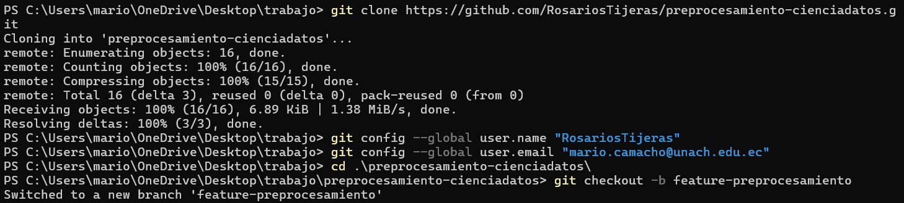
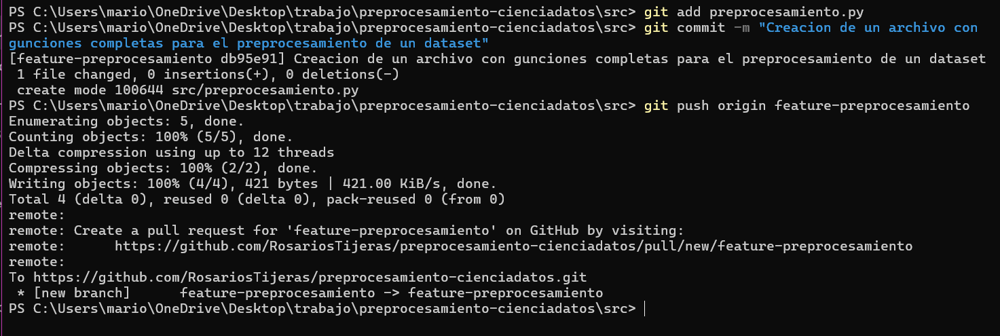
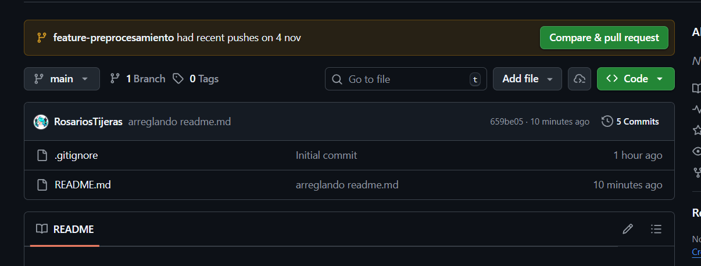
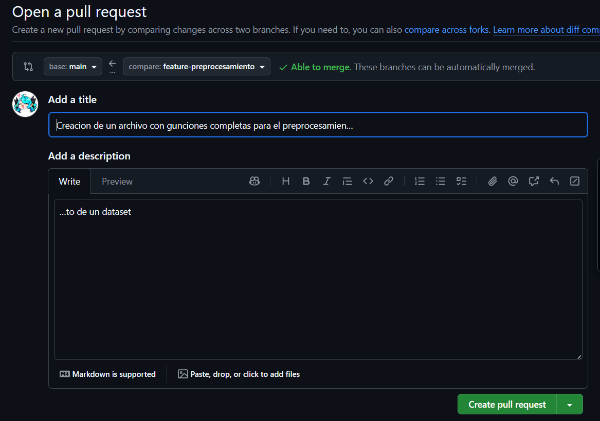
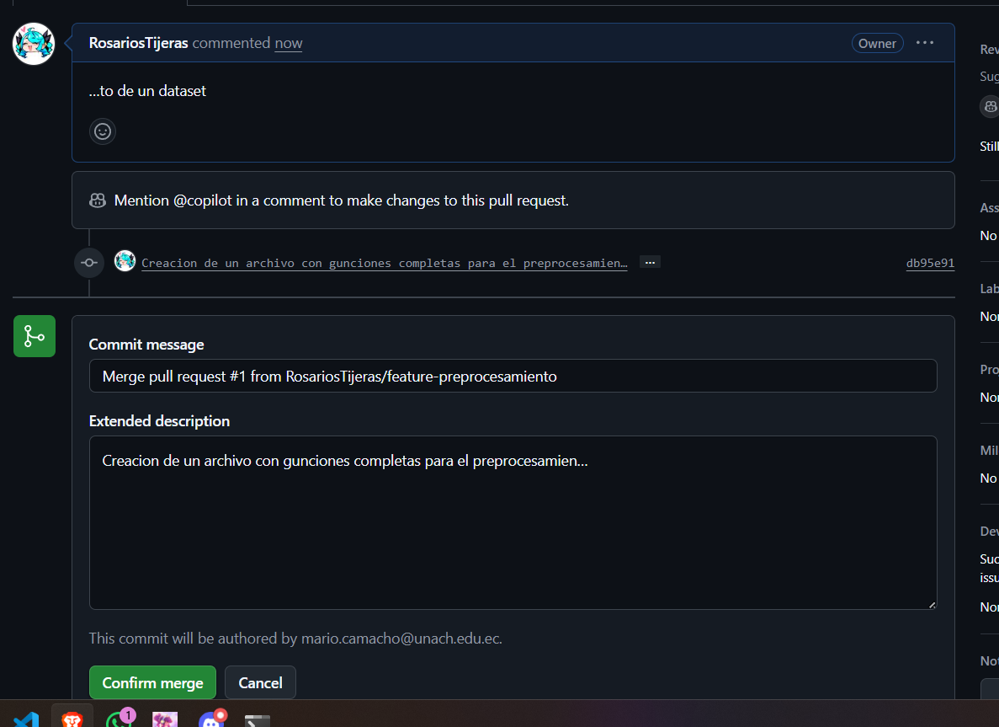
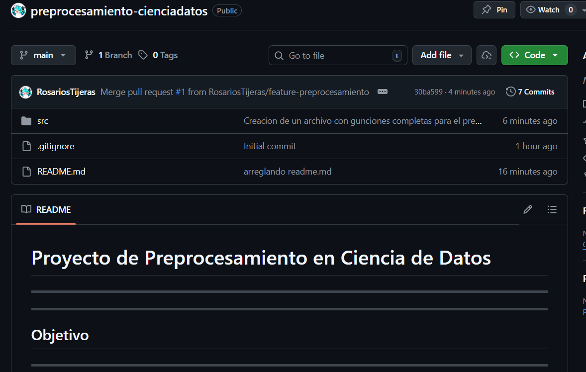
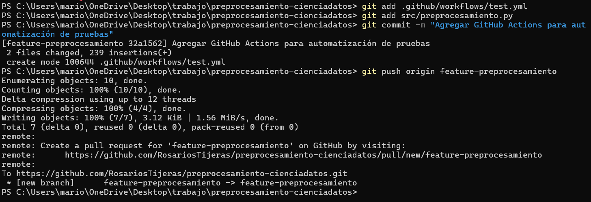

## Universidad Nacional de Chimborazo

**Facultad:** Facultad de Ingeniería  
**Carrera:** Ciencia de Datos e IA  
**Materia:** Cultura digital
**Docente:** Ronny Gonzalo Pomboza Granizo  
**Semestre:** Tercero

---

### Trabajo Autónomo 3
## **Uso de Git y GitHub para la gestión de versiones y la colaboración en proyectos de Ciencia de Datos**

**Autores:**  
- Mario Camacho

**Fecha:** 4 de noviembre de 2025

**Riobamba - Ecuador**

---

# Introducción


## Objetivo del Proyecto

Este proyecto busca alicar de una forma practica y eficiente de git combinado con github, que se usara para la gestion de versiones y la colaboracion en diversos proyectos en ciencia de datos

## Funcionalidades Implementadas

### Gestion de versiones con git
- creacion y configuracion de un repositorio local y en la nube con github
- Aplicacion de diversas ramas para un mejor desarrollo
- Buen manejo de commits de forma descriptiva y ordenados
- Pull resquests para revisiones de codigo y colaboracion del equipo
- Fusion de las ramas para implementar los cambios, ademas de limpieza de ramas obsoletas

## Comandos Git Usados


### Configuración Inicial y Clonación
1. Clonar Repositorio
```bash
git clone https://github.com/tu_usuario/preprocesamiento-cienciadatos.git
```
Lo que hace es crear una copia del repositiorio en mi maquina local, lo que ayuda a crear un entorno de trabajo que este sincronizado con github para comenzar un desarrollo

2. Configurar Usuario y Correo
```bash
git config --global user.name "Tu Nombre"
git config --global user.email "tuemail@example.com"
```
Define la identidad del usuario del que esta trabajando y se le asugnara a los commits, lo que ayuda a identificar quien hizo los cambios en el proyecto en trabajos colaborativos

### Gestión de Ramas y Flujo de Trabajo
3. Crear Nueva Rama
```bash
git checkout -b feature-preprocesamiento
```

Lo que hace es crear una nueva rama a partir de la principal, e inmediatamenta cambia a ella. lo que ayuda a desarrollar en un entorno aislado para agregar nuevas funcionalidades sin afectar la rama principal

### Control de Cambios y Versionado
4. Agregar Cambios al Área de Preparación
```bash
git add .
```
Prepara todos los ficheros que han sido modificados con el objetivo de incluirlos en el proximo commit, lo que permite seleccionar los cambios que se versionar

5. Hacer un Commit
```bash
git commit -m "Agregar función para preprocesamiento completo de datos"
```
Guarda todos los cambios realizados con un mensaje informativo, lo que ayuda a tener un historial claro y en colaboraciones ayuda a entender el trabajo de los demas

### Sincronización con Repositorio Remoto
6. Subir Cambios a GitHub
```bash
git push origin feature-preprocesamiento
```
Envia todos los cambios guardados de forma local al repositorio remoto, lo que permite compartir todo el trabajo modificado con un equipo ademas de guardar una copia de seguridad en la nube

7. Actualizar Repositorio Local
```bash
git pull origin main
```
Obtiene los últimos cambios del repositorio remoto y los fusiona con la rama local actual, lo que mantiene el desarrollo de la rama lo mas actualizado posible con los cambios realizados por otros colaboradores

8. Fusionar Ramas
```bash
git checkout main
git merge feature-preprocesamiento
```
integra todos los cambios realizados en una rama a la rama principal, lo que permite consolidar el trabajo realizado y avanzar en el desarrollo del proyecto

### Limpieza y Mantenimiento
9. Eliminar Rama Local
```bash
git branch -d feature-preprocesamiento
```
Elimina la rama que se uso para un desarrollo, lo que ayuda a mantener todo el reppositorio limpio y organizado, permite quitar ramas con desarrollo obsoleto

## Automatización: Explicación del Workflow de GitHub Actions Creado
Se implemento un workflow que esta integrado en github actions y lo que hace es automatizas la verficacion del preprocesamiento de los datos cada vez que se realice un oush o algun cambio en el codigo

### Funcionamiento del Workflow
#### Trigger de Ejecución

- Eventos activadores: push y pull_request

este se ejecuta cada ves que detecta algun tip ode cambio en el codigo que se sube en el repositorio

#### Proceso Automatizado

- Entorno limpio: Se crea máquina virtual Ubuntu desde cero

- Preparación:
    - Descarga del código actual

    - Instalación de Python 3.8

    - Instalación de librerías (pandas, scikit-learn, numpy, openpyxl)

- Ejecución:

    - Crea estructura de carpetas necesaria

    - Ejecuta el script completo de preprocesamiento

- Verificación:

    - Confirma que se generaron los archivos esperados

    - Reporta éxito o fallo automáticamente

#### Resultados Esperados

- Build exitoso: Todos los pasos se completan sin errores

- Archivos generados: data/dataset_ejemplo.csv y outputs/dataset_procesado.csv

- Logs detallados: Output del preprocesamiento visible en GitHub

## Capturas de Pantalla









## Repositorio del Proyecto
[https://github.com/RosariosTijeras/preprocesamiento-cienciadatos.git](https://github.com/RosariosTijeras/preprocesamiento-cienciadatos.git)

## Bibliografía
- Chacon, S., & Straub, B. (2014). *Pro Git* (2nd ed.). Apress. https://git-scm.com/book/en/v2
- GitHub. (n.d.). *GitHub Docs: Get started using Git*. https://docs.github.com/en/get-started/using-git
- Chacon, S., & Straub, B. (2014). *Pro Git*. Apress
- McKinney, W. (2018). *Python for Data Analysis*. O’Reilly Media.